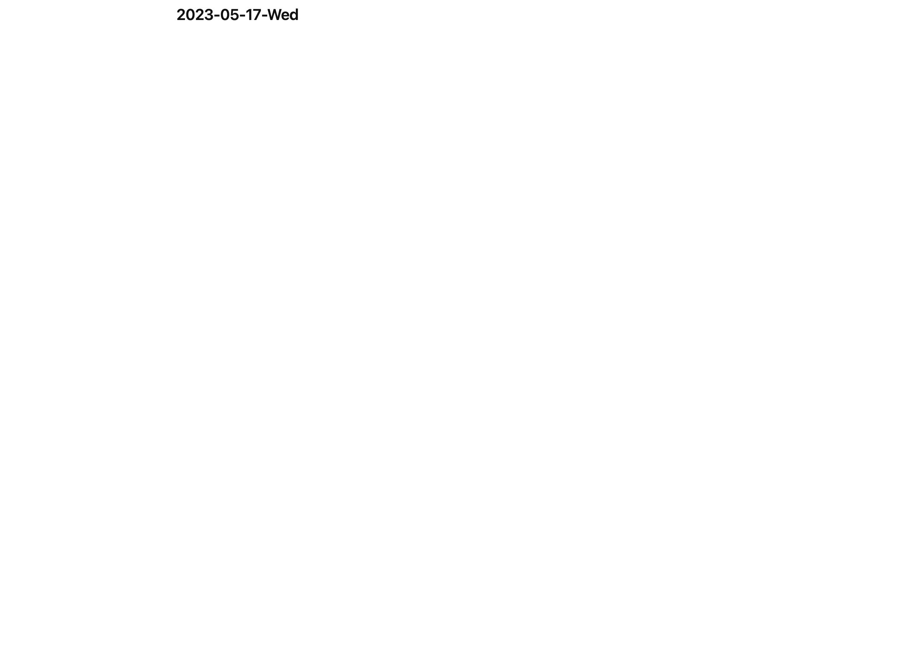

# alfred-GWAS 🧬
An [Alfred](https://www.alfredapp.com/) workflow to browse the GWAS catalog

<a href="https://github.com/giovannicoppola/alfred-GWAS/releases/latest/">
 
</a>

<!-- MarkdownTOC autolink="true" bracket="round" depth="3" autoanchor="true" -->

- [Motivation](#motivation)
- [Setting up](#setting-up)
- [Basic Usage](#usage)
- [Known Issues](#known-issues)
- [Acknowledgments](#acknowledgments)
- [Changelog](#changelog)
- [Feedback](#feedback)

<!-- /MarkdownTOC -->

<h1 id="motivation">Motivation ✅</h1>

- to obtain, without opening websites, a summarized version of all genes associated with a particular trait in the GWAS catalog, or all traits asssociated with a gene or locus.
- quickly access papers supporting a gene-trait association

<h1 id="setting-up">Setting up ⚙️</h1>

### Needed
- [Alfred 5](https://www.alfredapp.com/) with Powerpack license

<h1 id="usage">Basic Usage 📖</h1>

## Querying by gene 🧬
- launch with keyword (default: `gwg`) or custom hotkey, enter a search string. Results will include a gene name, the number of associated traits, and the number of papers.
- output is sorted by number of traits by default. Adding `--p` to the search string will sort by number of papers. 
- once a gene is selected, associated traits are shown, including for each trait the range of OR (or beta), minimum p-value, number of papers supporting the association, and number of associated loci. It is possible to refine the list of associated traits by entering an additional search string. 

	- `ctrl-enter` will show the currently selected gene-trait pair in large font, and copy to clipboard
	- `cmd-enter` will copy the entire gene-trait list to clipboard
	- `cmd-option-enter` will go back to the previous list
- once a gene-trait pair is selected, individual associations are shown, with OR min p-value, and source publication. 
 	- `ctrl-enter` will show the currently selected association in large font, and copy to clipboard
	- `cmd-enter` will copy the entire set of associations to clipboard
- once an individual association is selected, `enter` will open the supporting publication in Pubmed. 	

	
## Querying by trait 👤
- launch with keyword (default: `gwt`) or custom hotkey, enter a search string. Results will include a trait name, the number of associated genes, and the number of papers.
- once a trait is selected, associated genes are shown, including for each gene the range of OR (or beta), minimum p-value, number of papers supporting the association, and number of associated loci. It is possible to refine the list of associated genes by entering an additional search string. Alfred's QuickOutlook (`shift`) will show the expression profile from [GTEx](https://gtexportal.org/home/). Hit `shift` again to close. 
- output is sorted by number of supporting papers. Adding `--es` to the search string will sort by largest reported effect size (OR or beta). 
	- `ctrl-enter` will show the currently selected gene-trait pair in large font, and copy to clipboard
	- `cmd-enter` will copy the entire gene-trait list to clipboard
	- `cmd-option-enter` will go back to the previous list  
- once a gene-trait pair is selected, individual associations are shown, with OR min p-value, and source publication. 
 	- `ctrl-enter` will show the currently selected association in large font, and copy to clipboard
	- `cmd-enter` will copy the entire set of associations to clipboard
- once an individual association is selected, `enter` will open the supporting publication in Pubmed.  

## rebuilding database (optional) 🛠️
- `alfred-GWAS` ships with a prebuilt database derived from the GWAS catalog (v1.0.2, all associations), available [here](https://www.ebi.ac.uk/gwas/docs/file-downloads). The version in use is shown in the reference line of any copied output.
- the easiest way to update is the `::rebuild` keyword: it checks the EBI server for the current release, downloads it, and builds the database in the background. You can close Alfred while it runs, and run `::rebuild` again to check progress.
- alternatively run the script directly with `python3 build-GWAS-index.py "path-to-GWAS-file.tsv"`, or select the file in Finder and use the Universal Action. With no file argument the script downloads the latest release itself.
- rebuilding requires [pandas](https://pandas.pydata.org) (`pip3 install pandas`); the search keywords themselves need nothing beyond the system Python.
- the new database is built alongside the old one and only swapped in once it is complete, so a failed or interrupted rebuild leaves your existing database untouched.

<h1 id="known-issues">Limitations & known issues ⚠️</h1>

- gene search matches on gene symbols, synonyms and Ensembl ids. Genes that carry no annotation in the bundled lookup table are listed and searchable under their Ensembl id only.
- long lists are capped at the 200 best-ranked entries, with a closing item showing how many more matched. Type more of the name to narrow the list.
- let me know if you see anything else!

<h1 id="acknowledgments">Acknowledgments 😀</h1>

- Icons from [Flaticon](https://www.flaticon.com/)
	
	
<h1 id="changelog">Changelog 🧰</h1>

- version 0.5: `::rebuild` keyword with background download of the current catalog release; fixed drill-down on traits containing an apostrophe (e.g. Crohn's disease); genes with no annotation are no longer hidden from search; empty result sets and missing values no longer break a search; the rebuild no longer replaces the database until it has succeeded; long result lists are capped and the gene list of a trait can now be refined.
- 05-17-2023: version 0.4
- 03-25-2023: version 0.3
- 05-31-2022: version 0.2
- 12-12-2020: version 0.1

<h1 id="feedback">Feedback 🧐</h1>

Feedback welcome! If you notice a bug, or have ideas for new features, please feel free to get in touch either here, or on the [Alfred](https://www.alfredforum.com) forum. 

